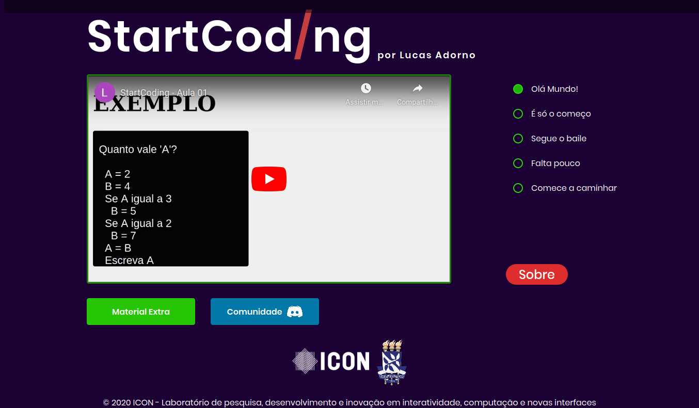
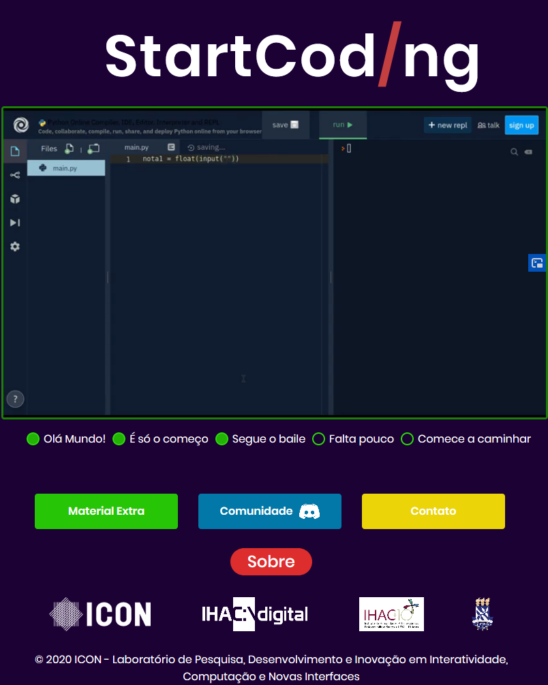
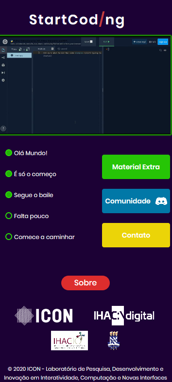

# StartCoding
#### Projeto criado para diminuir as barreiras das pessoas com o universo da programação através de um curso completo de introdução a programação utilizando como linguagem Python.

#### As tecnologias de criação do site são HTML, CSS e JavaScript(jQuery).

